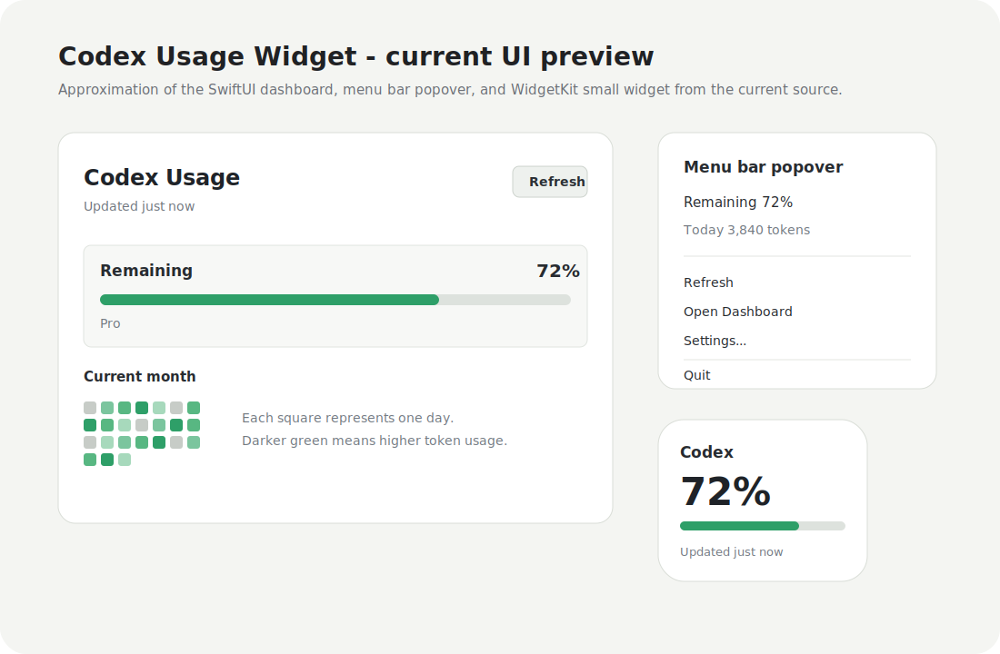
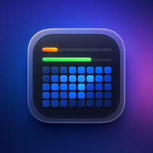

# Codex Usage Widget

Native macOS dashboard and WidgetKit widget for keeping an eye on local Codex usage.

> English | [简体中文](README.zh-CN.md)

Codex Usage Widget reads usage information from the local Codex App Server, stores a local snapshot, and renders it in a macOS app, menu bar item, and desktop widgets. It is designed for people who use Codex heavily and want a quick view of remaining allowance, weekly limits, monthly usage patterns, and recent usage trends.

The main advantage of this project is the desktop widget experience: once the app has refreshed usage data, the widget lets you glance at Codex allowance directly from the macOS desktop or Notification Center without opening the app.





## Highlights

- Native SwiftUI macOS app
- WidgetKit extension for small, medium, and large desktop widgets, the core product experience
- Overall remaining allowance and current usage progress
- Weekly remaining progress when Codex exposes weekly rate-limit data
- Current-month daily heatmap, generated from day 1 through the last day of the month
- Recent 7-day usage trend
- Configurable refresh interval
- Optional menu bar status item
- Launch at Login support
- Test data mode for UI and widget validation
- Diagnostics panel for refresh status, App Group access, cache path, and Codex executable path
- Local-only cache; no analytics, no external telemetry, no credential storage

## How New Users Can Use It

There are two practical ways to use this project today.

### Option 1: Try the app window only

Use this path if you do not have Apple Developer Program membership or you only want to check whether local Codex usage loading works.

1. Install full Xcode.
2. Install Codex and sign in.
3. Clone this repository.
4. Run:

```bash
./script/build_and_run.sh --verify
```

This launches the unsigned macOS app window. You can test live usage loading, progress bars, monthly heatmap, 7-day trend, Settings, and Diagnostics. The system desktop widget may not work in this mode because WidgetKit extensions require proper signing and App Group access.

### Option 2: Use the full desktop widget

Use this path if you want the real product experience: Codex usage visible as a macOS widget.

1. Install full Xcode.
2. Install Codex and sign in.
3. Fork or clone this repository.
4. Replace the placeholder bundle identifiers and App Group with your own values.
5. Configure the same Apple Team and App Group for both the app target and widget extension target.
6. Build and run the app from Xcode.
7. In the app, click Refresh once or enable test data from Settings.
8. Open macOS widget editing, search for `Codex Usage`, and add the small, medium, or large widget.
9. Enable **Launch at Login** in Settings if you want the widget cache to stay fresh in the background.

If the widget is blank or says setup is needed, open **Settings > Diagnostics** in the app and confirm App Group availability, cache path, Codex executable path, and the latest refresh status.

## Why The Widget Matters

The app window is useful for setup and diagnostics, but the widget is the feature that makes the project different from a normal dashboard.

- **Small widget**: quick remaining-allowance glance.
- **Medium widget**: remaining allowance plus compact daily/monthly context.
- **Large widget**: richer dashboard with overall remaining, weekly remaining, today/month totals, monthly heatmap, reset timing, and 7-day trend.

The widget reads the latest local snapshot written by the app. This keeps the widget lightweight and avoids storing credentials inside the widget extension.

## Important Status Notes

This is an open-source preview release. It is useful for local testing and personal workflows, but it is not an official OpenAI product and is not distributed through the Mac App Store.

The app depends on local Codex App Server methods:

- `account/rateLimits/read`
- `account/usage/read`

Usage data is available only when the local Codex installation and the signed-in account expose those APIs. Some authentication methods or accounts may return unsupported or unauthenticated responses.

## Requirements

- macOS 14 or newer
- Full Xcode, not only Command Line Tools
- Codex installed and signed in locally
- A usage-supported Codex account/auth method
- Apple development signing configured in Xcode if you want to install and use the system widget

You can run the main app window without Apple Developer Program membership. The desktop widget is stricter because macOS must install the WidgetKit extension and allow it to read the shared App Group container.

## Quick Start

Clone the repository:

```bash
git clone https://github.com/LilRayyyy/codex-usage-widget.git
cd codex-usage-widget
```

Run tests:

```bash
swift test
```

Run the app window without signing:

```bash
./script/build_and_run.sh --verify
```

This unsigned run path is useful for checking the dashboard, progress bars, monthly heatmap, settings, diagnostics, and local Codex usage loading.

To use the actual desktop widget, continue with [Widget Setup](#widget-setup). The unsigned command above is not enough for full WidgetKit installation on most Macs.

## Widget Setup

To use the macOS desktop widget, both the app target and the widget extension target must use the same Apple Team and the same App Group.

This setup is required because the app writes `usage-snapshot.json` and the widget reads it from the shared App Group container. If the App Group differs between targets, the app may work while the widget stays empty.

Default open-source placeholder:

```text
$(AppIdentifierPrefix)group.com.example.CodexUsageWidget
```

In your fork, replace the bundle identifiers and App Group with your own reverse-DNS identifier. For example:

```text
PRODUCT_BUNDLE_IDENTIFIER = com.yourname.CodexUsageWidget
PRODUCT_BUNDLE_IDENTIFIER = com.yourname.CodexUsageWidget.Widget
$(AppIdentifierPrefix)group.com.yourname.CodexUsageWidget
```

Then in Xcode:

1. Open `CodexUsageWidget.xcodeproj`.
2. Select the `CodexUsageWidget` target.
3. Set your Team under `Signing & Capabilities`.
4. Add or confirm the App Groups capability.
5. Repeat the same Team and App Group for `CodexUsageWidgetWidgetExtension`.
6. Build and run the app once so it can write `usage-snapshot.json`.
7. In the app, click Refresh once. If you are only testing UI, enable **Use test data** in Settings.
8. Open macOS widget editing, search for `Codex Usage`, and add the widget.
9. If the widget does not appear, restart the app, rebuild the widget extension, or restart the macOS widget host by logging out and back in.

If Xcode cannot provision App Groups or the widget extension for your account, the app window can still run locally, but full WidgetKit installation may require a paid Apple Developer Program team.

## Refresh Behavior

WidgetKit refresh timing is controlled by macOS. The widget displays the latest cached snapshot and may not update immediately after every app refresh.

The app:

- refreshes usage on the configured interval while it is running
- writes the latest snapshot to the shared App Group container
- asks WidgetKit to reload timelines after a successful refresh

The widget:

- reads the latest cached snapshot
- requests a new timeline roughly every 5 minutes
- may still be throttled by macOS

For more reliable background updates, enable **Launch at Login** in Settings.

## Settings

Open **Codex Usage Widget > Settings** to configure:

- **Refresh interval**: how often the running app refreshes Codex usage
- **Use test data**: writes generated sample usage data to the shared cache
- **Codex executable**: path to the local Codex executable used for App Server JSON-RPC calls
- **Show menu bar icon**: controls the menu bar item
- **Launch at login**: registers or unregisters the app with macOS login items

The Diagnostics tab shows:

- latest refresh status
- last refresh attempt
- last error
- App Group availability
- cache path
- Codex executable path
- live/test data mode

This information is useful when filing issues.

## Widget Empty States

The widget shows explicit guidance when it cannot render live data:

- open the app and refresh once if no cache exists yet
- sign in to Codex if the local Codex App Server reports unauthenticated
- check signing and App Group setup if the widget cannot access the shared container
- open Settings > Diagnostics if refresh failed

## Privacy

Codex Usage Widget is local-first:

- usage snapshots are stored locally as JSON
- the widget reads only the local snapshot written by the app
- the app does not upload analytics
- the app does not store Codex credentials
- the repository does not include personal signing identities, Team IDs, provisioning profiles, or prebuilt signed app bundles

## Development

Run core tests:

```bash
swift test
```

Run the optional live Codex App Server smoke test:

```bash
LIVE_CODEX_APP_SERVER_TEST=1 swift test --filter LiveCodexAppServerSmokeTests
```

Run the local app entrypoint:

```bash
./script/build_and_run.sh
```

Build a signed release zip locally:

```bash
./script/package_release.sh
```

The release script writes:

```text
release/CodexUsageWidget-0.1.0-macOS.zip
```

Only attach a prebuilt zip to public releases if you are intentionally distributing your own signed build. Non-notarized builds may trigger macOS Gatekeeper warnings on first launch.

## Distribution Notes

You do not need Mac App Store distribution to open-source this project. Other users can clone the repository and build it themselves with Xcode and their own signing team.

Publishing a notarized prebuilt app, or distributing through the Mac App Store, requires Apple Developer Program membership.

## Release Checklist

Before publishing a release:

1. Confirm `swift test` passes.
2. Confirm Xcode builds the app and widget targets.
3. Replace placeholder bundle identifiers and App Group values with your own if distributing a signed build.
4. Do not commit `DerivedData`, `.build`, `SignedDerivedData`, `release`, zip/dmg artifacts, provisioning profiles, or Xcode `xcuserdata`.
5. Confirm no personal Team ID, email address, token, local path, or signing identity appears in the repository.
6. Include the matching `CHANGELOG.md` entry in the release notes.

## License

MIT. See [LICENSE](LICENSE).
