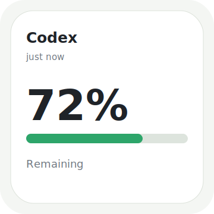
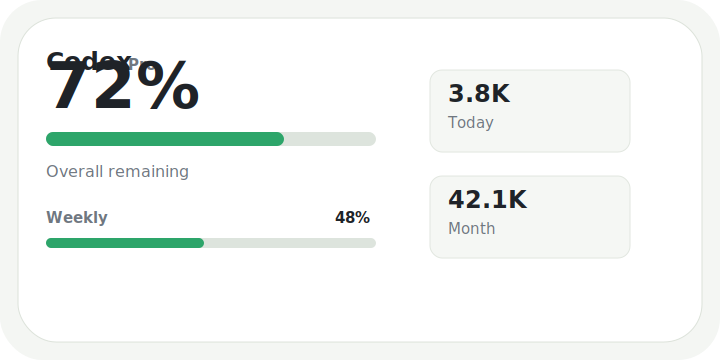
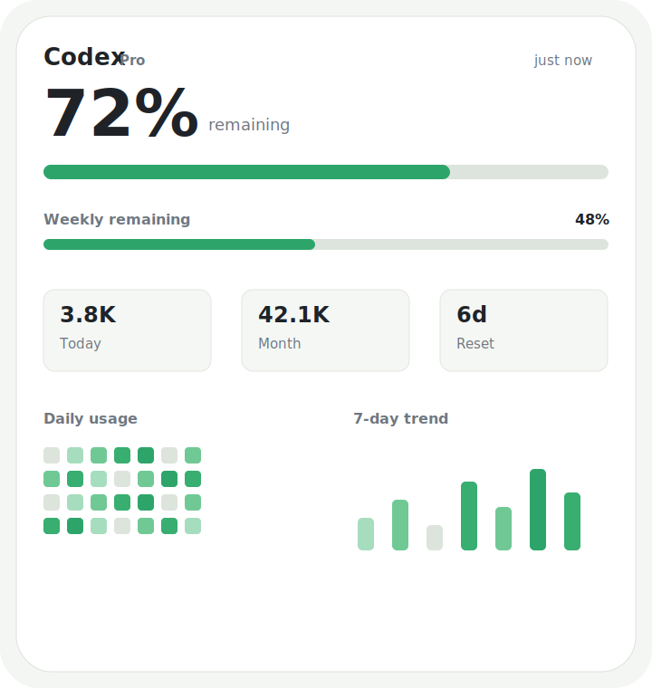

# Codex Usage Widget 中文说明书

[English](README.md) | 简体中文

Codex Usage Widget 是一款原生 macOS 应用和 WidgetKit 小组件，用来在本地查看 Codex 用量、剩余额度、周额度余量、月度每日用量热力图，以及最近 7 天用量趋势。

它通过本机 Codex App Server 读取数据，把快照写入本地缓存，再由 app、菜单栏和桌面小组件显示。项目不上传分析数据，不保存 Codex 凭据，也不会把你的 Apple 签名信息放进仓库。

这个项目最大的特点是桌面小组件体验：app 负责读取和刷新数据，小组件负责把 Codex 剩余额度和用量趋势放到 macOS 桌面或通知中心里，让你不用每次打开 app 也能快速查看。


## 小组件截图

小组件是这个产品最重要的展示界面。它的目标不是让你每次都打开完整仪表盘，而是把 Codex 用量和剩余额度直接放到 macOS 桌面上，随时扫一眼就能知道当前状态。

| Small | Medium | Large |
| --- | --- | --- |
|  |  |  |

## 项目状态

这是一个开源预览版，适合本地测试和个人工作流使用。它不是 OpenAI 官方产品，也不是 Mac App Store 上架版本。

当前版本重点是：

- 可以本地构建运行
- 可以通过 Xcode 签名后安装 WidgetKit 小组件
- 可以在 GitHub 上开源给其他用户自行构建
- 不内置任何个人 Team ID、签名证书、配置描述文件或已签名 app 包

## 主要功能

- 原生 SwiftUI macOS 应用
- small / medium / large 三种桌面小组件布局，这是本项目的核心体验
- 总额度剩余进度
- 周额度剩余进度，前提是 Codex 暴露该数据
- 当月每日用量热力图，从 1 号显示到当月最后一天
- 最近 7 天用量趋势
- 可配置自动刷新间隔
- 可选菜单栏图标
- 开机自启动
- 测试数据模式，方便验证 UI 和 widget
- Settings 设置页
- Diagnostics 诊断面板
- widget 空状态提示，例如未登录、未刷新、App Group 配置错误等

## 新用户应该如何使用

目前这个项目有两种实际使用方式。请先根据你的目标选择路径。

### 方式一：只体验 app 主窗口

如果你还没有 Apple Developer Program 会员，或者只是想确认本机 Codex 用量能不能读取，先用这个方式。

1. 安装完整 Xcode。
2. 安装 Codex，并在本机登录。
3. 克隆本仓库。
4. 运行：

```bash
./script/build_and_run.sh --verify
```

这个命令会用无签名方式启动 macOS app 主窗口。你可以测试实时用量读取、进度条、月度热力图、最近 7 天趋势、设置页和诊断页。

注意：这个方式通常只能测试 app 主窗口，不一定能完整启用系统桌面小组件。原因是 WidgetKit extension 需要正确签名，并且 app 和 widget 必须通过同一个 App Group 共享缓存。

### 方式二：完整使用桌面小组件

如果你想体验这个软件真正的优势，也就是把 Codex 用量显示在 macOS 桌面小组件里，请使用这个方式。

1. 安装完整 Xcode。
2. 安装 Codex，并在本机登录。
3. fork 或 clone 本仓库。
4. 把占位 bundle id 和 App Group 替换成你自己的值。
5. 在 Xcode 中给 app target 和 widget extension target 配置同一个 Apple Team。
6. 给两个 target 配置同一个 App Group。
7. 从 Xcode 构建并运行 app。
8. 在 app 中点击 Refresh 一次，或者在 Settings 中开启 **Use test data** 先验证 UI。
9. 打开 macOS 桌面小组件编辑界面，搜索 `Codex Usage`，添加 small、medium 或 large 小组件。
10. 如果希望小组件后台持续更新，打开 Settings，启用 **Launch at login**。

如果小组件没有内容、显示空状态，或者根本找不到小组件，请先打开 app 的 **Settings > Diagnostics**，检查 App Group 是否可用、缓存路径是否存在、Codex 路径是否正确、最近一次刷新是否成功。

## 为什么小组件是核心优势

主 app 用来设置、刷新和诊断；真正让这个项目有价值的是 macOS 桌面小组件。

- **Small 小组件**：适合快速看剩余额度。
- **Medium 小组件**：适合同时看剩余额度和简要的日/月信息。
- **Large 小组件**：适合显示更完整的仪表盘，包括总剩余额度、周剩余额度、今日/月度用量、月度热力图、重置时间和最近 7 天趋势。

小组件不会直接保存 Codex 凭据。它只读取 app 写入到本地共享容器里的最新快照，因此更轻量，也更符合本地优先的隐私设计。

## 系统要求

- macOS 14 或更新版本
- 完整 Xcode，不只是 Command Line Tools
- 本机已安装并登录 Codex
- 当前 Codex 账号或认证方式支持用量 API
- 如果要使用系统桌面小组件，需要在 Xcode 里配置 Apple 开发签名

只运行 app 主窗口不一定需要 Apple Developer Program 会员。桌面 widget 更严格，因为 macOS 需要安装 WidgetKit extension，并允许 app 和 widget 通过同一个 App Group 共享缓存。

## 数据来源

应用使用本机 Codex App Server JSON-RPC 集成，目前会调用：

```text
account/rateLimits/read
account/usage/read
```

如果本机 Codex、登录账号或认证方式不支持这些接口，应用会显示 unsupported 或 unauthenticated 状态。这属于数据源限制，不一定是 app 本身损坏。

## 快速开始

克隆仓库：

```bash
git clone https://github.com/LilRayyyy/codex-usage-widget.git
cd codex-usage-widget
```

运行测试：

```bash
swift test
```

无签名运行 app 主窗口：

```bash
./script/build_and_run.sh --verify
```

这个方式适合检查主窗口、进度条、月度热力图、设置页、诊断页，以及本机 Codex 用量读取是否正常。

如果你要使用真正的桌面小组件，请继续阅读下一节“如何启用桌面小组件”。仅运行上面的无签名命令，通常不足以让 WidgetKit 小组件在 macOS 中完整工作。

## 如何启用桌面小组件

要让 macOS 桌面小组件出现在 widget 列表里，并且能读到 app 写入的缓存，app target 和 widget extension target 必须：

- 使用同一个 Apple Team
- 使用同一个 App Group

这是因为 app 会写入 `usage-snapshot.json`，而 widget 会从共享 App Group 容器读取这个文件。如果两个 target 的 App Group 不一致，就会出现 app 正常显示、widget 没有内容的情况。

开源仓库默认使用占位值：

```text
$(AppIdentifierPrefix)group.com.example.CodexUsageWidget
```

你 fork 后应替换成自己的反向域名，例如：

```text
PRODUCT_BUNDLE_IDENTIFIER = com.yourname.CodexUsageWidget
PRODUCT_BUNDLE_IDENTIFIER = com.yourname.CodexUsageWidget.Widget
$(AppIdentifierPrefix)group.com.yourname.CodexUsageWidget
```

然后在 Xcode 中：

1. 打开 `CodexUsageWidget.xcodeproj`。
2. 选择 `CodexUsageWidget` target。
3. 在 `Signing & Capabilities` 里设置自己的 Team。
4. 添加或确认 App Groups capability。
5. 对 `CodexUsageWidgetWidgetExtension` target 重复同样设置。
6. 构建并运行 app 一次，让它写入 `usage-snapshot.json`。
7. 在 app 中点击 Refresh 一次。如果只是测试界面，可以先在 Settings 中启用 **Use test data**。
8. 打开 macOS 桌面 widget 编辑界面，搜索 `Codex Usage` 并添加。
9. 如果小组件列表中找不到它，重启 app、重新构建 widget extension，或者通过注销再登录来刷新 macOS 的 widget 宿主。

如果 Xcode 提示你的账号无法配置 App Groups 或 widget extension，那么主 app 仍可本地测试，但完整桌面小组件安装可能需要付费 Apple Developer Program 会员。

## 刷新机制说明

macOS 的 WidgetKit 刷新不是实时可控的。系统会根据自己的策略调度 widget 时间线，所以小组件不一定在 app 每次刷新后立刻变化。

当前实现：

- app 运行时按设置间隔刷新 Codex 用量
- app 刷新成功后写入本地共享缓存
- app 会请求 WidgetKit reload timelines
- widget 大约每 5 分钟请求一次新时间线
- macOS 仍可能节流 widget 刷新

如果希望 widget 数据更稳定，建议在 Settings 中开启 **Launch at login**，让 app 开机后自动运行并持续更新缓存。

## 设置页说明

打开 **Codex Usage Widget > Settings** 可以配置：

- **Refresh interval**：app 运行时的自动刷新间隔
- **Use test data**：写入生成的测试数据，方便调试 UI 和 widget
- **Codex executable**：本机 Codex 可执行文件路径
- **Show menu bar icon**：是否显示菜单栏图标
- **Launch at login**：是否开机自启动

## 诊断页说明

Settings 里的 Diagnostics 标签会显示：

- 当前刷新状态
- 最近一次刷新尝试时间
- 最近错误
- App Group 是否可用
- 缓存路径
- Codex 可执行文件路径
- 当前是 live data 还是 test data 模式

如果你在 GitHub 提 issue，建议附上这些诊断信息，但不要附带任何账号、token、个人路径或签名证书内容。

## 小组件空状态说明

widget 无法显示实时数据时，会尽量给出明确提示：

- 如果还没有缓存，会提示先打开 app 并刷新一次
- 如果 Codex 未登录，会提示登录 Codex
- 如果 App Group 配置错误，会提示检查 app 和 widget 的签名及 App Group
- 如果刷新失败，会提示打开 Diagnostics 查看原因

## 隐私说明

Codex Usage Widget 是本地优先设计：

- 用量快照只保存在本地 JSON 文件中
- widget 只读取 app 写入的本地快照
- app 不上传分析数据
- app 不保存 Codex 凭据
- 开源仓库不包含个人 Team ID、签名证书、配置描述文件或已签名 app 包

## 本地开发

运行核心测试：

```bash
swift test
```

运行可选 live smoke test：

```bash
LIVE_CODEX_APP_SERVER_TEST=1 swift test --filter LiveCodexAppServerSmokeTests
```

运行本地 app：

```bash
./script/build_and_run.sh
```

构建本地 release zip：

```bash
./script/package_release.sh
```

脚本会输出：

```text
release/CodexUsageWidget-0.1.0-macOS.zip
```

只有当你明确想发布自己的签名构建时，才建议把这个 zip 上传到 GitHub Release。未 notarize 的构建在首次打开时可能触发 macOS Gatekeeper 提示。

## 发布注意事项

开源到 GitHub 不需要 App Store 上架。其他用户可以 clone 后用自己的 Xcode 和签名配置自行构建。

如果你想发布预编译 app、做 notarization，或上架 Mac App Store，通常需要 Apple Developer Program 会员。

发布前建议检查：

1. `swift test` 是否通过。
2. Xcode 是否能构建 app 和 widget target。
3. 是否已经把占位 bundle id 和 App Group 替换成自己的值。
4. 不要提交 `DerivedData`、`.build`、`SignedDerivedData`、`release`、zip/dmg、provisioning profile 或 Xcode `xcuserdata`。
5. 不要提交个人 Team ID、邮箱、token、本机路径、签名身份。
6. Release notes 和 `CHANGELOG.md` 是否一致。

## 许可证

MIT，详见 [LICENSE](LICENSE)。
